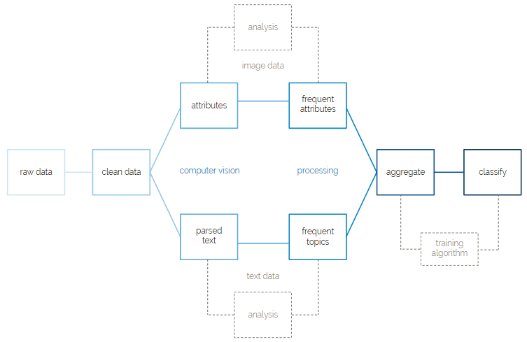

# Project Overview

The NSF Hurricane Harvey project is a research project as a part of the Computational Media Lab at the University of Texas at Austin that seeks to leverage machine learning and computer vision technologies in order to aid rescuers and rescuees in times of natural disaster.       
At the core of the NSF Hurricane Harvey project is a set of 1000 images collected by journalists in the field from individuals who were affected by Hurricane Harvey. These images, combined with a much larger set of noise data, media unrelated to Hurricane Harvey, have been passed to Google Vision and then used to train a machine learning model. This model differentiates between signal data, media pertaining to Hurricane Harvey, and noise data. In addition, this model has been trained to classify the signal data between images representing rescuees, people who were in need of rescue at the time of Hurricane Harvey, and rescuers, people who took part in rescue efforts at the time of Hurricane Harvey.
There are many long-term goals of this project. First is to perfect the machine learning model’s ability to differentiate between signal and noise and between rescuee and rescuer. Second is to increase the size of the signal and noise data sets. Currently, we are examining various Twitter archived data sets to increase the size of the noise data set in particular. Third is to fully automate and integrate this project into existing social media platforms. For example, in times of disaster, bots could continuously surf these social media sites and scrape data to be passed to the model. Once passed to the model, content from social media sites will be flagged as either signal or noise, and if signal, rescuer or rescuee.
Workflow

# Getting Started

## Installation

All required python packages are listed in requirements.txt of the root directory. Due to some dependencies on the boxpython package, the project uses Python 2.7. You can install all packages by running the following command: pip install -r requirements.txt

## Accounts

As a part of the project, you will need the following to access all files, media, and resources:
Box account for research directory with utexas email
Box account for developer directory with non utexas email
Google Drive
CrowdTangle (optional)
TACC account (optional)
Github

### Box

 To get up and running with Box, first log into the Box project that you have been added to with your gmail. Go to the Box developer console, select the Harvey project, and then click on the configuration tab in the menu on the left side of the screen. Scroll down to the “OAuth 2.0 Credentials.” Open a python interactive shell inside of a terminal by running: python. Inside of the interactive shell, run the command: import keyring. Then run the following two lines, copying in the client id and client secret into each of the sections <YOUR CLIENT ID> and <YOUR CLIENT SECRET> respectively:
`keyring.set_password("system", "BOX_CLIENT_ID", "< YOUR CLIENT ID>")
keyring.set_password("system", "BOX_CLIENT_SECRET", "< YOUR CLIENT SECRET>")`
Exit out of python interactive by running: `quit()`.

Then at the bottom of the page, uncomment the lines:
`flow = BoxAuthenticateFlow(keyring.get_password("system", "BOX_CLIENT_ID"), keyring.get_password("system", "BOX_CLIENT_SECRET"))
flow.get_authorization_url()`

Also comment out the line:
`box = setup_box()`

The next paragraph of steps must be done quickly because the auth code refreshes every 30 seconds. Read through the steps in this paragraph before proceeding. Navigate to the following website and click the button: https://app.box.com/api/oauth2/authorize?state=box_csrf_token_soKrToJp8Fjdd9sd&response_type=code&client_id=cd0xj5a7m6x5fqzvt6ej5gm9dkoux7zw&redirect_uri=http%3A%2F%2F127.0.0.1
You should be navigated to an error page; however the URL of the error page is what is important. At the end of the URL should say: code = <RANDOM AUTH CODE>. Copy and paste the refresh token in the URL into the line in the code:
`access_token, refresh_token = flow.get_access_tokens('YOUR CODE HERE')`
Quickly run: `python box.py`. If you receive an error, most likely you were too slow in copying the auth code from the URL to the code and running the code again - repeat the steps in this paragraph. If you successfully run: `python box.py`, you have generated and saved the access and refresh tokens. Now you can comment out the lines at the bottom that you uncommented. Lastly, uncomment the line so that it is the only line at the bottom that is uncommented:
`box = setup_box()`

You now will have appropriate keys stored in keyring. From here, you should be set to make Box API calls.

If you have any questions about authentication or configuring the API keys for Box, reach out to Justin Segler at [justin@justinsegler.com](justin@justinsegler.com).

### Google Vision

To get up and running with Google Vision, we have to generate another access key. You should have received an invite to collaborate on our Google Project called Harvey. Log into the project dashboard. On the top left hand corner, click the hamburger menu and select “APIs and Services”. Then in the side menu on the left side of the screen, navigate to the Credentials section. Click the Create New Credentials button at the top of the screen and generate a new API key. Once you have generated this API key, we need to save this key on keyring. Open up google_vision.py. At the bottom of the file, there is another section commented out. Uncomment this section and replace <YOUR API KEY HERE> with the Google Vision API key that you generated. Once you have done this, you can run: `python google_vision.py` from a terminal to save the key to your keyring. Then you can comment back the section at the bottom of the file. You should now have the API token saved so that you have access to the Google Vision APIs.

If you have any questions about authentication or configuring the API keys for Google Vision, reach out to Justin Segler at [justin@justinsegler.com](justin@justinsegler.com).

# Files Overview

### attributes.py
Provides functions for analyzing attributes used to count frequent attributes and filter infrequent attributes. Used during the computer vision and processing steps of workflow.

### box.py
A collection of calls to interface with a Box developer account. Contains basic file operations and also hinges on google_vision.py to pipe files directly from Box to Google Vision. Used during computer vision step of workflow. Requires one time authentication through keyring.

### google_vision.py
Handles requests and responses to Google Vision. Formats Google Vision response into output read by attributes.py. Used during computer vision step of workflow. Requires one time authentication through keyring.

### graph.py
Various functions to graph results. Each function creates a specific graph from output file(s). Used in post analysis.

### main.py
Combines functions across files to create the main pipeline. Sends images from Box through Google Vision, analyzes attribute frequency, filters attributes through frequency heuristic, and creates predictive models from results. Output from each step of the pipeline is written to a file.

### ml.py
Creates an assortment of supervised learning models. Contains functions for saving and loading classifiers including naive bayes, decision tree, k nearest neighbor, support vector machine, stochastic gradient descent, and multilayer perceptron. Also supports voting and stacking classifiers using a combination of base classification models. Used during classification step at end of workflow.

### read_csv.py
Various functions for reading and converting excel and csv files. Parses human coded results files. Used during preprocessing.

### request.py
Connects with Box and abstracts out request calls by handling authentication and REST request formatting. Used during computer vision step of workflow.

### text.py
Processes text content by creating a topic model used as attributes for text classification. Used during processing step of workflow.

### utils.py
Provides functions to execute http requests and encode images into base64. Used during computer vision step of workflow.

### analysis/
Material created during pre and post analysis. Mostly saved images of graphs and corresponding data files.

### classifiers/
Collection of classifiers saved during to disk and organized by type, algorithm, and frequency threshold. Classifiers can be loaded during prediction steps to avoid recreating model each run.

### output/
Output files created during computer vision and processing steps of the workflow. Files are organized by type and use. Most files are either computer vision response, attributes ordered by decreasing frequency, or filtered attribute lists.
